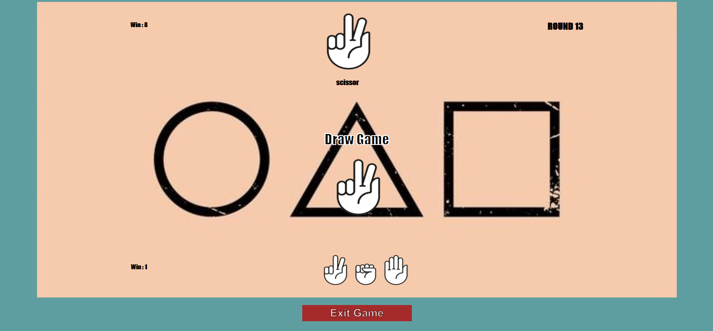

# The Paper rock scissors game build with javascript

> A mini of Paper Rock Scissors game the player should Win the AI player

## Build with

- HTML5
- JAVASCRIPT
- CSS

## Getting started

to get a local copy up and follow this steps

### Setup and installl

- Clone this repository (click on the code button)
- Go in the Cloned repository and open the HTML file with the Browser

### Play

- To play The game Click on start Button
- Choose one of the hand Image there is three choice Paper,Scissor and Rock.
- It's for the Ai player to choose.
- The paper win the rock ,the rock win the scissor,the scissor win the paper.
- To increase the win score you should win the Ai player
- There is endless round till you exit the game.

### The idea

I watched squid game tv show and i noticed that they didn't play PRS, I decide to build this game to share my coding passion

## The Author

- GitHub: [@minos95](https://github.com/mino95)
- Twitter: [@aminos_rahal](https://twitter.com/aminos_rahal)
- LinkedIn: [rahal sidahmed](https://www.linkedin.com/in/sid-ahmed-elamine-rahal-8722541a3/)
